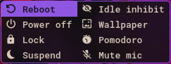
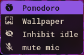

# Optionizer 3000

Got options? Want to execute them? This is for you.  

Optionizer 3000 takes any options you have and lets you choose between them
in a convenient presentation. Add labels, icons, commands and customize as much as you need.

<p align="center">
    
</p>

"Doesn't it look just like a power menu?" Well, it started as one. I was using wofi as my power menu, but the window size kept bugging out, so I made this as a replacement. You can gut it, replace the example options and add whatever you want. Optionizer 3000 just executes a command by selecting its respective label inside the window.

## Requirements

Build dependencies:
- GCC
- GNU Make
- pkg-config

Runtime dependencies:
- A Wayland compositor with layer shell support like Sway or Hyprland
- GTK 4
- GTK 4 Layer Shell
- systemd (**optional:** for the built-in reboot, power off and suspend commands)
- hyprlock (**optional:** for the built-in lock command)
- Symbols Nerd Font (**optional:** for the built-in icons and style settings)
- RobotoMono Nerd Font (**optional:** default font used in the style settings)

The built-in icons, labels and commands can be overridden in the [configuration file](examples/config#L3) and the font settings can be changed in the [style file](examples/style.css#L6).

## Installation

```bash
# Clone the repository and compile
git clone https://github.com/torisaurus2003/optionizer-3000.git
cd optionizer-3000
make

# Create the user configuration folder
mkdir -p ~/.config/optionizer-3000/

# Copy the configuration files to the user directory
cp ./examples/config ~/.config/optionizer-3000/
cp ./examples/style.css ~/.config/optionizer-3000/

# Run the executable
./optionizer-3000
```
The program comes with its own built-in configuration and overrides it with any user configuration found in ```~/.config/optionizer-3000/config```. Without ```~/.config/optionizer-3000/style.css``` the program will use the global GTK theme.

## Configuration Options
- **icons=*str* (icon1,icon2,icon3,...)**  
Comma separated list of option icons. Default is ",󰐥,󰌾,󰤄".
- **labels=*str* (label1,label2,label3,...)**  
Comma separated list of option labels. Default is "Reboot,Power off,Lock,Suspend".
- **commands=*str* (command1,command2,command3,...)**  
Comma separated list of option commands. Default is "systemctl reboot,systemctl poweroff,hyprlock,systemctl suspend"

The icons, labels and commands should contain the same number of elements and use the same order, with the elements at the same position belonging to the same option. Labels and commands can work together without icons, and labels and icons can work together without commands, but the program needs **at least** one label in order to create the window. In order to skip an element from any of the three lists, its place has to be replaced with " ".

- **width=*int***  
Sets the window's width in pixels. Default is 200
- **height=*int***  
Sets the window's height in pixels. Default is 1
- **label_align=*str* (left|center|right)**  
Sets the horizontal alignment for the text label. Default is center.
- **label_spacing=*int***  
Sets the spacing between the icon and text labels in pixels. Default is 10.
- **listbox_spacing=*int***  
Sets the spacing between the listboxes (or columns) of the window in pixels. Default is 0.
- **max_rows=*int***  
Sets the maximum amount of rows per listbox (or columns). Default is 4.
- **title=*str***  
Sets the window title. Default is "optionizer-3000".
- **set_as_layer=*bool***  
Sets the window's layer shell protocol. Default is true.
- **namespace=*str***  
Sets the window's namespace (requires set_as_layer=true). Default is "optionizer-3000".
- **x_pos=*int***  
Sets the window's horizontal position in pixels (requires set_as_layer=true). Default is unset
- **y_pos=*int***  
Sets the window's vertical position in pixels (requires set_as_layer=true). Default is unset. If both x_pos and y_pos are unset, the window defaults to the center. The position increases from left to right and top to bottom


## Styling configuration

The following classes can be configured inside "style.css":

- **.window**: the window itself
- **.listbox**: the listbox containing the rows
- **.row**: the row containing the icon and label
- **.icon**: the option icon
- **.label**: the option label

If using nerd fonts, it's recommended to configure the icons like this:

```css
.window {
	font-family: Symbols Nerd Font Mono, RobotoMono Nerd Font Mono;
}
```
which makes it so the Symbols font overrides the icons in the main font, preventing possible size mismatches.

## Want it to do something else?

Open ```~/.config/optionizer-3000/config``` and add a new item to the [labels list](examples/config#L2), along with its respective icon and command (if needed):

```c
icons=,󰐥,󰌾,󰤄,
labels=Reboot,Power off,Lock,Suspend,new_label
commands=systemctl reboot,systemctl poweroff,hyprlock,systemctl suspend,new_command
```
The new option will be there the next time you open the window:

<p align="center">
    
</p>

Or you can build your own menu:

```c
icons=,󰸉,󰈉,󰍭
labels=Pomodoro,Wallpaper,Inhibit idle,mute mic
commands=pomodoro,random,idle-inhibit,wpctl set-mute @DEFAULT_AUDIO_SOURCE@ toggle
```

<p align="center">
	
</p>
