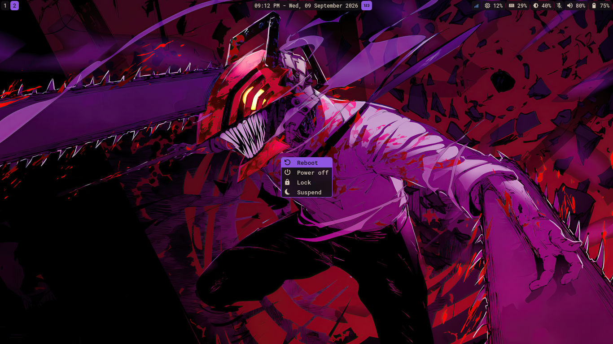
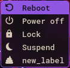

# optionizer-3000

Got options? want to execute them? This is for you.  

optionizer-3000 takes any options you have and lets you choose between them
in a convenient presentation. Add labels, icons, commands and customize as much as you need.

<p align="center">
    
	
</p>

Doesn't it look like a power menu? well, it is, or at least that's how it started. I was using wofi as my power menu, but the window size kept bugging out, so yeah.

## Requirements

Build dependencies:
- GCC
- GNU Make
- pkg-config

Runtime dependencies:
- A Wayland compositor with layer shell support like Sway or Hyprland
- GTK 4
- GTK 4 Layer Shell
- systemd (optional)
- hyprlock (optional)
- RobotoMono Nerd Font (optional)
- Symbols Nerd Font (optional)

The reboot, power off, lock and suspend commands can be changed in the [configuration file](examples/config#L3) and the font configuration can be changed in [the style file](examples/style.css#L6), therefore, systemd, hyprlock, RobotoMono Nerd Font and Symbols Nerd Font aren't strict dependencies.

## Installation

```bash
# Clone the repository and compile
git clone https://github.com/torisaurus2003/optionizer-3000.git
cd optionizer-3000
make

# Create the user configuration folder
mkdir -p ~/.config/optionizer-3000/

# Copy the configuration files to the user directory
cp ./examples/config ~/.config/optionizer-3000/
cp ./examples/style.css ~/.config/optionizer-3000/

# Run the executable
./optionizer-3000
```
The program comes with its own built in configuration and overrides it with any user configuration found in ```~/.config/optionizer-3000/config```. Without ```~/.config/optionizer-3000/style.css``` the program will use the global GTK theme.

## Configuration Options
- **icons=*str* (icon1,icon2,icon3,...)**  
Comma separated list of option icons
- **labels=*str* (label1,label2,label3,...)**  
Comma separated list of option labels
- **commands=*str* (command1,command2,command3,...)**  
Comma separated list of option commands

Preferably, the icons, labels and commands contain the same number of elements and are ordered as they appear in the window from top to bottom. Lables and commands can work by themselves, same with labels and icons, but the program needs **at least** one label in order to create the window. In order to skip an element from any of the three lists, its place has to be replaced with " ".

- **width=*int***  
Sets the window's width in pixels. Default is 200
- **height=*int***  
Sets the window's height in pixels. Default is 1
- **x_pos=*int***  
Sets the window's horizontal position in pixels. Default is NULL
- **y_pos=*int***  
Sets the window's vertical position in pixels. Default is NULL. If both x_pos and y_pos are not set, the window defaults to the center. The position increases from left to right and top to bottom
- **label_align=*str* (left|center|right)**  
Sets the horizontal alignment for the text label. Default is center.
- **spacing=*int***  
  Spacing between the icon and the text label in pixels. Default is 0.


## Styling configuration

The following classes can be configured inside "style.css":

- **.window**: the window itself
- **.listbox**: the listbox containing the rows
- **.row**: the row containing the icon and label
- **.icon**: the option icon
- **.label**: the option label

If using nerd fonts, it's recommended to configure the icons like this:

```css
.window {
	font-family: Symbols Nerd Font Mono, RobotoMono Nerd Font Mono;
}
```
which makes it so the Symbols font overrides the icons in the main font, preventing possible size mismatches.

## Want it to do something else?

Open ```~/.config/optionizer-3000/config``` and add a new item to the [labels list](examples/config#L2), along with its respective icon and command (if needed):

```c
icons=,󰐥,󰌾,󰤄,
labels=Reboot,Power off,Lock,Suspend,new_label
commands=systemctl reboot,systemctl poweroff,hyprlock,systemctl suspend,new_command
```
The new option will be there the next time you open the window:

<p align="center">
    
</p>

Or just gut it, remove everything and add whatever you want. This just executes a command by selecting its respective label inside the window.

<p align="center">
    
</p>
